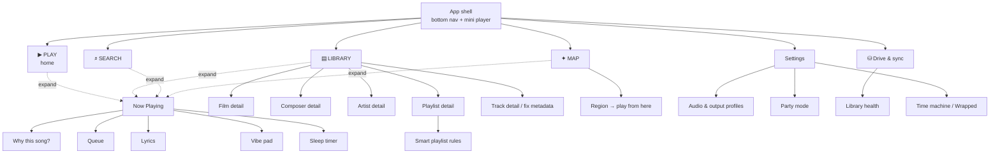

# OTOZINE — screen inventory and flow

Every screen the app needs, what is on it, and when it gets built.

**Design premise:** the algorithm is the product. So the home screen is not a
list of files — it is what is playing and why. Browsing is the escape hatch, not
the default.

**Control is layered** (your call during planning): auto by default → tap the
*why* chip for the reason → pull the drawer for dials. A user who never opens a
drawer should still get a good queue.

---

## The hierarchy decision that shapes everything

Standard players browse **Artist → Album → Track**. That is wrong for this
library, and your own data proves it:

```
Pakkam Vanthu   composer Anirudh Ravichander   album Kaththi
Selfie Pulla    composer Anirudh Ravichander   album Kaththi
Aathi           composer Anirudh Ravichander   album Kaththi
```

`album` is the **film**. The headline credit is the **music director**, not the
playback singer — nobody looks for "the Anirudh album", they look for *Kaththi*,
or for everything Anirudh scored. Meanwhile English tracks in the same library
*do* follow Artist → Album.

So the library has **two browse spines** and picks per track:

| track language | primary spine | secondary |
|---|---|---|
| Tamil (film) | Film → Composer | Singer |
| English / independent | Artist → Album | — |

Every list row therefore renders `title / composer · film` or
`title / artist · album` depending on which fields exist. One row component,
two modes.

---

## Navigation model

Single activity, Compose `NavHost`, four bottom destinations. Now Playing is an
overlay that expands from a persistent mini-player, never a separate tab —
because you reach it constantly and it must not cost a navigation.



---

## Screen inventory

Phase numbers match the build plan. **P0 = exists today** (plain, unstyled).

| # | screen | phase | why it exists |
|---|---|---|---|
| 1 | App shell (nav + mini player) | P0→P4 | frame everything hangs off |
| 2 | **Now Playing** | P0→P4 | the centrepiece |
| 3 | **PLAY** home | P3 | the algorithmic surface |
| 4 | Queue / Up Next | P3 | see and reorder what's coming |
| 5 | **Why this song?** | P3 | trust + doubles as the labelling UI |
| 6 | Vibe pad | P3 | manual steering |
| 7 | Library home | P1 | browse by film / composer / artist |
| 8 | Film detail | P1 | the Tamil primary spine |
| 9 | Composer detail | P1 | the other Tamil spine |
| 10 | Artist detail | P1 | English spine + playback singers |
| 11 | Playlist detail | P2 | manual + smart |
| 12 | Smart playlist rules | P5 | rule DSL editor |
| 13 | Track detail / fix | P2 | correct metadata by hand |
| 14 | Search | P3→P5 | text now, semantic later |
| 15 | **Listening DNA map** | P4 | signature feature |
| 16 | Drive & sync | P2 | the pendrive's own screen |
| 17 | Library health | P2 | what ingest got wrong |
| 18 | Settings | P2 | the usual |
| 19 | Audio & output profiles | P3 | per-route EQ + normalisation |
| 20 | Lyrics | P5 | synced .lrc |
| 21 | Sleep timer | P5 | late-night ramp-down |
| 22 | Time machine / Wrapped | P5 | offline stats |
| 23 | Party mode | P5 | LAN queue |
| 24 | First-run / import | P2 | onboarding |

24 screens. **7 are load-bearing** (2, 3, 5, 7, 8, 16, 13); the rest can arrive late.

---

## 1. App shell

Persistent frame. Bottom nav + mini player stacked above it.

- **Bottom nav** — 4 items, thick black outline, hard offset shadow, active item
  rotated ~2° with a sticker-like fill.
- **Mini player** — art thumb (halftone), title, composer·film, play/pause,
  hairline progress. Swipe up expands to Now Playing; swipe right skips.
- **Header** — drive-status pill (connected / cached / stale), settings cog.

The drive pill is not decoration: whether the pendrive is attached changes what
is playable, so it belongs where you always see it.

---

## 2. Now Playing ★

The screen you look at most. Everything else is subordinate.

**Content, top to bottom**

| block | contents |
|---|---|
| Art | Cover with screentone/halftone shader; chromatic aberration pulsed on beat onsets (timestamps precomputed at ingest — free at runtime) |
| Titles | Title (large). Below: `composer · film` for Tamil, `artist · album` for English. Tap composer/film → its detail screen |
| **Why chip** | One line: *"you play Anirudh after 10pm"*. Tap → screen 5 |
| Scrubber | Waveform, with **hook marker**, intro-end and outro-start ticks from the DSP stage. Drag to scrub; long-press jumps to the hook |
| Transport | prev · play/pause · next, shuffle mode, repeat |
| Badges | `144 BPM · 11B · −2.5 dB · ta` — mono type. Camelot + gain visible because they explain transitions |
| Actions | ♥ love, ✕ veto, ＋ playlist, ♫ lyrics, ⏱ sleep, ⋯ |
| Output | `WIRED` / `BT · LDAC` / `SPEAKER` pill — the queue and EQ change with it, so it must be visible |

**Interactions:** swipe down dismiss · swipe left/right change track · long-press
art → full-bleed art · double-tap → love.

**Motion:** speed lines on track change, direction matching the swipe.

---

## 3. PLAY (home) ★

Not a file list. The algorithm's front door.

| block | contents |
|---|---|
| Hero | Big "continue" card — what's playing or what it wants to play next, with reason |
| Vibe strip | Horizontal chips: *Late night · Walking · Focus · Kuthu · Melody · Rediscover* — one tap starts a shaped session |
| **Adventure slider** | Comfort ⟷ Adventure. The bandit's exploration budget, exposed as one control |
| Rediscovery row | *"You loved this 8 months ago"* — 3–5 cards |
| Fresh row | Never-played tracks, placed by embedding proximity (no cold start) |
| Continue row | Recently played, resumable |
| Session arc | Small sparkline of the planned energy curve for this session |

Empty state (no history yet): drop the personalised rows, show *"Play anything —
I'll learn"* plus the library shuffle.

---

## 4. Queue / Up Next

- Two sections: **Up next** (algorithmic) and **Queued by you** (manual, always
  plays first).
- Each row: title, composer·film, and a **micro-reason** (*"key-compatible"*,
  *"−12% BPM"*, *"not heard in 4 months"*).
- Drag to reorder, swipe to remove.
- **"Reshuffle from here"** — regenerates the tail without touching history.
- Header shows the transition rule in force: *"avoiding 38 recent A→B pairs"* —
  makes the anti-repetition machinery visible.

---

## 5. Why this song? ★

The trust feature that is secretly the training pipeline.

- **Reasons, weighted**, as bars:
  - `similar to Vaathi Coming` — 0.82
  - `you play Anirudh at 11pm` — 0.44
  - `not heard in 4 months` — 0.31
- Each reason gets 👍 / 👎. A 👎 down-weights that signal — this is the label.
- **What I think this is:** language, mood coordinates, energy, danceability,
  BPM, key — with a *"this is wrong"* link into Track detail.
- **More like this / Less like this** — seeds or blocks a neighbourhood.
- Footer: *"corrections so far: 14 — accuracy on your library: 91%"*.

---

## 6. Vibe pad

Bottom sheet, thumb-reachable.

- **2D pad**: X = sad ⟷ happy (valence), Y = calm ⟷ intense (arousal). Both are
  real Essentia outputs, not invented. Drag the puck → queue regenerates live.
- Preset pucks scattered as stickers: *Study · Gym · Rain · 2am · Party*.
- **Filters**: language (ta / en / instrumental), era slider, composer include /
  exclude chips.
- Duration: *next 30 min / 1 hr / open-ended*.
- `REGENERATE` — chunky, unmissable.

---

## 7. Library home

Tabs: **Films · Composers · Artists · Songs · Playlists · Languages**

Films is first — deliberately, per the hierarchy above.

- Grid of film cards (poster, title, year, track count).
- Sort: recently added / most played / year / A–Z.
- Sticky A–Z scrubber for long lists.
- Header shows counts: `14 songs · 9 films · 6 composers`.

---

## 8. Film detail ★

- Poster header with year, composer, track count, total runtime.
- Track list in film order (uses `track_no`).
- `PLAY` / `SHUFFLE` / `+ QUEUE`.
- **"More from this composer"** and **"Same year"** rows.
- Long-press a track → Track detail.

## 9. Composer detail

- Header: name, film count, track count, **era span** (*1976–2024* is meaningful
  for Ilaiyaraaja).
- Grouped by film, newest first.
- **"Signature sound"** — the composer's centroid in mood space, rendered as a
  small blob on the valence/arousal plane. Distinctive and genuinely useful.
- `PLAY ALL` / `SHUFFLE ALL`.

## 10. Artist detail

Same shape, for playback singers and English artists. Splits *"sung by"* from
*"composed by"* when both apply.

---

## 11. Playlist detail

- Manual: drag to reorder, swipe to remove.
- Smart: shows the live rule (*"Tamil · 120–140 BPM · not played in 60 days"*)
  with an **edit** affordance and a live match count.
- `PLAY` / `SHUFFLE` / `EDIT` / `EXPORT .m3u`.

## 12. Smart playlist rules

Visual rule builder over the tag/DSP columns: language, composer, film, year,
BPM range, key, energy, valence, last-played, play count, never-played.
AND/OR groups. Live preview of matches underneath.

---

## 13. Track detail / fix metadata ★

Where a wrong parse gets corrected — the UI for `otozine fix`.

- All fields editable: title, artist, composer, film, year, language.
- **Provenance per field**: `filename (0.80)` / `itunes (0.50)` / `you`.
  Seeing where a value came from is what makes a bad one obvious.
- A corrected field is **pinned** — badge saying re-ingest will not overwrite it.
- Analysis block (read-only): BPM, key, LUFS, gain, true peak, intro/outro/hook.
- Tags by source, each removable.
- File info: path, codec, bitrate, size, content hash.
- `RE-ANALYSE` · `FIND ARTWORK` · `DELETE`.

---

## 14. Search

- Single field, two modes, no mode switch:
  - **Text** — FTS5 over title/artist/album, instant.
  - **Semantic** — *"sad rainy guitar"*, *"late night kuthu"* via CLAP. Results
    marked with a ✦ so you know which engine answered.
- Filter chips under the field: language, composer, era, BPM, key.
- Recent + suggested searches when empty.
- Results grouped: Songs / Films / Composers / Artists.

---

## 15. Listening DNA map

The signature screen.

- Library projected to 2D (UMAP, precomputed on PC) as a star field.
- Dot colour = mood; size = play count; dim = never played.
- **Your session path** drawn as a trail across the field.
- Pinch/pan. Tap a region → *"play from here"*. Lasso → make a playlist.
- Toggles: colour by mood / language / composer / era.
- **Negative space is visible** — the empty regions are the music you never
  touch, which is exactly what the exploration budget targets.

---

## 16. Drive & sync ★

The pendrive gets its own screen because it is the source of truth.

| block | contents |
|---|---|
| Status | Big: `DRIVE CONNECTED` / `RUNNING FROM CACHE` / `DRIVE NOT FOUND` |
| Storage | Two bars: phone cache (used / budget) and drive (used / free) |
| Counts | `14 on phone · 14 on drive · 0 pending upload` |
| Last sync | Relative time + what moved |
| Actions | `SYNC NOW` · `CHANGE CACHE BUDGET` · `FORGET DRIVE` |
| Pending | Play events waiting to be written back to the drive |
| Cache plan | What the planner would add/drop next sync, and why |

---

## 17. Library health

What ingest could not work out — the honest screen.

- Untagged / low-confidence tracks, sorted worst-first, each a tap from fixing.
- Missing files (on drive but not cached, or source gone).
- Never-analysed tracks (ML stages pending).
- Duplicates found and collapsed.
- Per-language metadata hit rate — the number that tells you whether the Tamil
  path is working.

---

## 18–19. Settings · Audio & output

**Settings:** theme + chaos level (shaders on/off/reduced), crossfade duration,
gapless, normalisation target LUFS, language preferences, storage budget,
online lookups on/off, AcoustID key, about/licences.

**Audio & output:** per-route profiles — **Wired / Bluetooth / Speaker** each
with its own EQ curve, normalisation target and queue bias. Shows the live route
and codec. This is where "wired at 11pm ≠ BT on a bus" becomes real.

---

## 20–23. Later screens

- **Lyrics** — synced .lrc, current line highlighted, tap a line to seek.
- **Sleep timer** — 15/30/45/60 min or *end of track*, with a fade-out ramp.
- **Time machine / Wrapped** — any period, fully offline. Top films, composers,
  hours, discovery rate, *"on this day last year"*.
- **Party mode** — QR code to a local hotspot page; guests add to the queue from
  a browser. No internet.

## 24. First run

1. Welcome — one screen explaining the drive model.
2. Notification permission (needed or the media notification is suppressed).
3. Find drive → pick folder via SAF.
4. Import progress with live counts.
5. *"Play something so I can start learning"*.

---

## Shared components

Build these once:

| component | used by |
|---|---|
| `TrackRow` — dual-mode (composer·film / artist·album) | 4, 7–11, 14, 17 |
| `AnalysisBadges` — BPM · key · gain · language | 2, 13, and TrackRow |
| `WhyChip` — one-line reason, tappable | 2, 3, 4 |
| `ArtTile` — art + halftone shader + fallback | everywhere |
| `MoodBlob` — valence/arousal mini-plot | 5, 6, 9 |
| `StorageBar` — used/free with budget marker | 16 |
| `ChunkyButton` / `StickerChip` / `OutlineCard` | everywhere |
| `SpeedLines`, `PaperGrain`, `GlitchTransition` (AGSL) | P4 |

## States every list screen needs

Loading (skeleton) · Empty (distinct copy per screen) · Error · **Offline-but-fine**
(normal here, must never look like an error) · **Drive missing** (playable from
cache, degraded not broken).

---

## Build order

| step | screens | outcome |
|---|---|---|
| **now** | 1, 2, 7, 8, 16 | a real, usable player |
| next | 13, 17, 24 | you can fix what ingest got wrong |
| then | 3, 4, 5, 6, 9, 10, 14 | the algorithm becomes visible and steerable |
| then | 15 + full P4 restyle | the app becomes *itself* |
| last | 11, 12, 19–23 | depth |

Screens 1, 2, 7, 8, 16 are the minimum that beats your phone's stock player.
